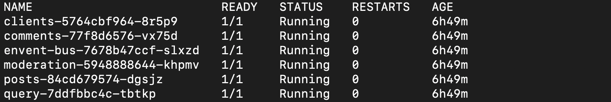
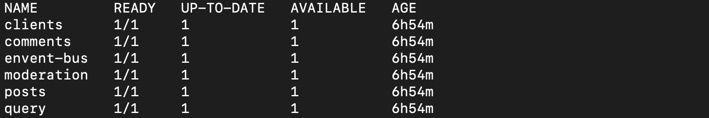
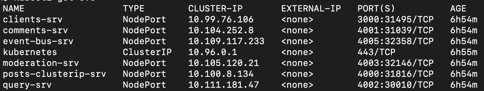

# Projet fil rouge

## Introduction

Ce projet est une application microservices construite avec Node.js et React. Il est conçu pour être déployé sur Kubernetes.

## Table des matières

- [Introduction](#introduction)
- [Table des matières](#table-des-matières)
- [Github](#github)
- [Installation](#installation)
- [Test](#Test)
- [Affichage-web](#affichage-web)

## Github
### Fork :
Faite un fork du projet dans votre repertoire github.

1. Clonez ce dépôt :
```bash
git clone https://github.com/hachemmosbah/Pojet_fil_rouge.git

```

## Installation

1. Builder les images Docker

```bash
- sudo docker build -t clients ./client

- sudo docker build -t comments ./comments

- sudo docker build -t query ./query 

- sudo docker build -t event-bus ./event-bus

- sudo docker build -t moderation ./moderation 

- sudo docker build -t posts ./posts
```
2. deployement:

Pour deployer avec kubernetes :
```bash
- kubectl apply -f dpl-clients.yml
- kubectl apply -f dpl-comments.yml
- kubectl apply -f dpl-envent-bus.yml
- kubectl apply -f dpl-moderation.yml
- kubectl apply -f dpl-posts.yml
- kubectl apply -f dpl-query.yml
- kubectl apply -f ingress-srv.yml
``` 

 Autre méthode:

Cette méthode fait en sorte de crée les dockerfile ainsi que le deploiment et l'ingress

```bash
bash command.sh
```

## Test 
Pour tester que les pods sont en marche ainsi que les deploiements et les services lancer les testes suivants:

1. Pods
```bash
kubectl get pods
```
On verra que tous les pods sont bien **Running**


2. deployments
```bash
kubectl get deployments
```
On verra que le deployement 


3. services
```bash
kubectl get svc
```
On verra que les services


4. logs
```bash
kubectl logs <name_pods>
```
Pour voir si nos logs n'affiche pas d'erreurs

## Affichage web
Ouvrez une page web et entrez dans la barre d'addresse l'url suivant :
```url
http://localhost/?(.*)
```